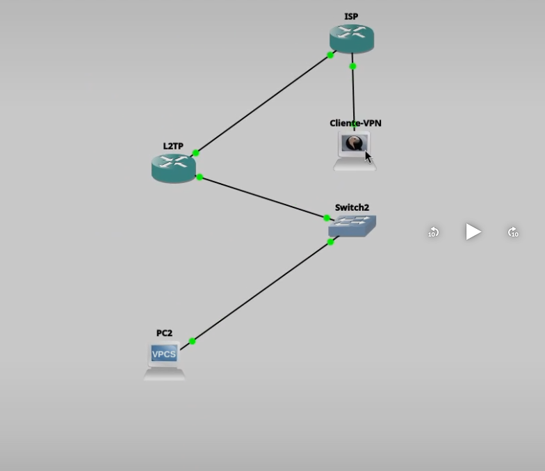
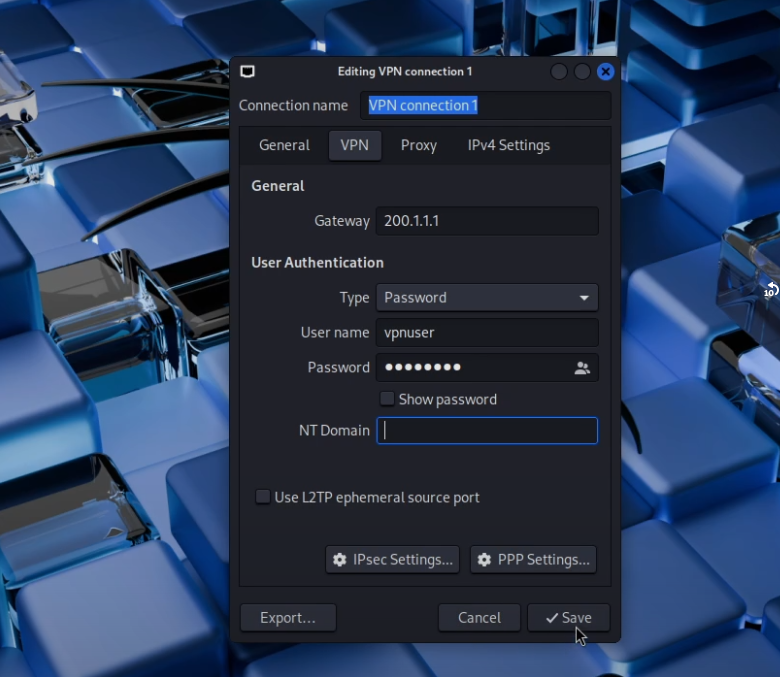
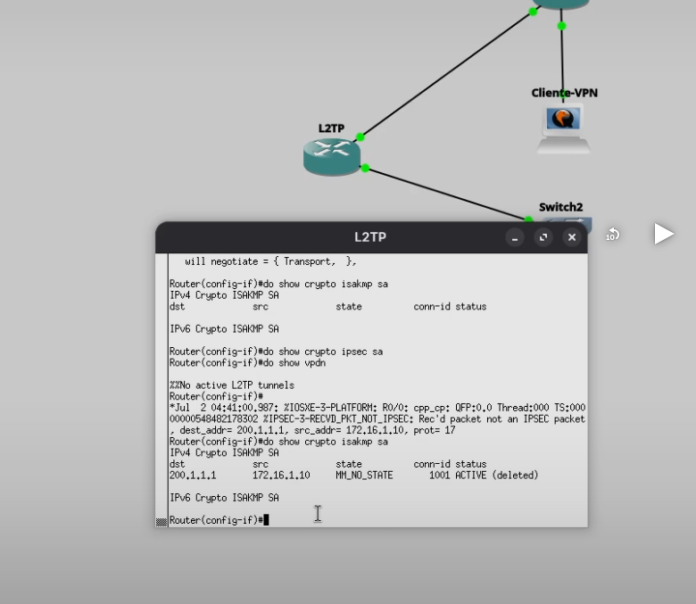

# VPN Client-to-Site Punto a Multipunto IPSec IKEv1 con L2TP

## Descripción

En esta práctica se implementó una VPN Client-to-Site utilizando L2TP protegido mediante IPSec IKEv1. Un cliente Linux establece un túnel seguro hacia un router Cisco actuando como servidor L2TP, permitiendo el acceso remoto a la red LAN privada a través de Internet.

---

# Objetivo

Implementar una VPN Client-to-Site utilizando L2TP sobre IPSec IKEv1 para permitir el acceso remoto seguro desde un cliente Linux hacia una red LAN protegida.

---

# Topología



La topología está compuesta por:

- Router L2TP (Servidor VPN)
- Router ISP
- Cliente VPN (Linux)
- Switch
- PC de la LAN

---

# Direccionamiento IP

## Router L2TP

| Interfaz | Dirección |
|----------|-----------|
| GigabitEthernet0/0 | 200.1.1.1 |
| GigabitEthernet0/1 | 192.168.10.1 |

---

## Cliente VPN

IP pública asignada por el ISP.

---

## LAN

| Equipo | Dirección |
|---------|-----------|
| Router LAN | 192.168.10.1 |
| PC2 | 192.168.10.10 |

---

# Parámetros utilizados

| Parámetro | Valor |
|-----------|-------|
| Tipo VPN | Client-to-Site |
| Tecnología | L2TP sobre IPSec |
| IKE | Version 1 |
| Encriptación | AES |
| Hash | SHA |
| Autenticación | Pre-Shared Key |
| Usuario VPN | vpnuser |
| Clave Compartida | cisco123 |
| Cliente | Linux (NetworkManager L2TP) |

---

# Configuración

La configuración completa utilizada durante la práctica se encuentra incluida en el repositorio dentro del script del router Cisco.

---

# Funcionamiento

El cliente Linux establece una conexión L2TP protegida mediante IPSec hacia el router Cisco. Una vez autenticado correctamente, el cliente obtiene acceso a la red privada 192.168.10.0/24 como si estuviera conectado localmente.

Todo el tráfico entre el cliente remoto y la red LAN viaja cifrado mediante IPSec.

---

# Evidencias

## Topología


Topología utilizada para la implementación de la VPN Client-to-Site.

---

## Configuración del cliente VPN



Se configuró la conexión L2TP en Linux especificando:

- Gateway del servidor VPN.
- Usuario VPN.
- Contraseña.
- Tipo de autenticación por contraseña.

---

## Configuración IPSec


Dentro de las propiedades IPSec se configuró:

- Enable IPSec Tunnel
- Pre-Shared Key (PSK)
- Autenticación mediante clave compartida.

---

## Asociación IKEv1



Se verificó el establecimiento de la negociación IKE mediante:

```bash
show crypto isakmp sa
```

La salida confirma que la asociación ISAKMP fue creada correctamente.

---

## Comunicación con la red remota


Una vez establecida la VPN se realizó un traceroute desde el cliente Linux hacia la PC de la LAN (192.168.10.10), verificando que el tráfico atraviesa el túnel VPN y alcanza correctamente la red privada.

---

# Comandos de verificación

Durante la práctica se utilizaron los siguientes comandos para validar el funcionamiento:

```bash
show crypto isakmp sa

show crypto ipsec sa

show vpdn

show users
```

---

# Video demostrativo

La demostración completa del funcionamiento de la práctica puede visualizarse en:

https://youtu.be/6I22GJcbzk8?si=lEyy27OFMm1GUO07

---

# Autor

**Alvaro Baez Tavera**

**Matrícula:** 20211150

**Instituto Tecnológico de las Américas (ITLA)**

**Carrera:** Tecnólogo en Ciberseguridad
